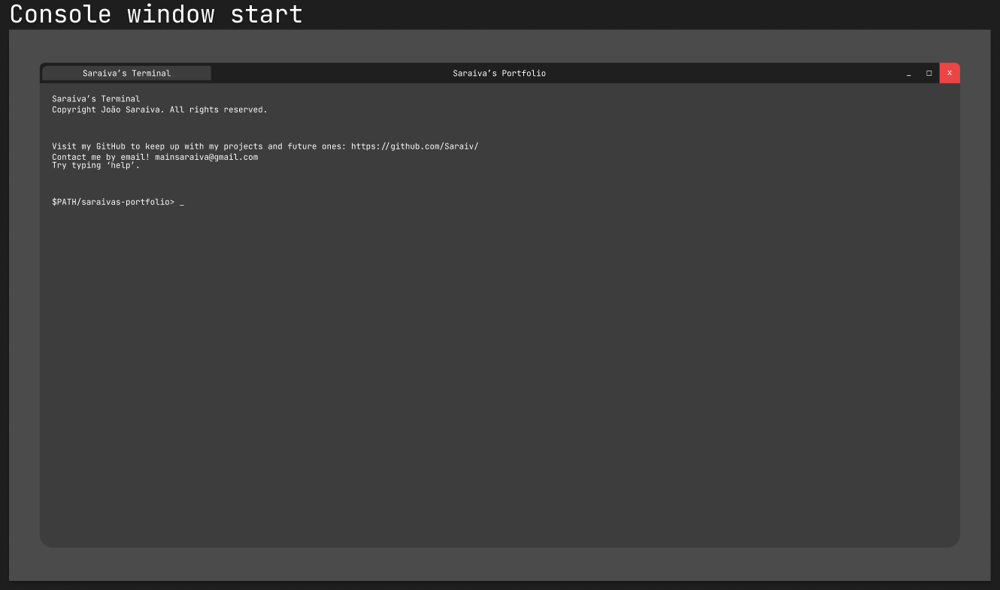
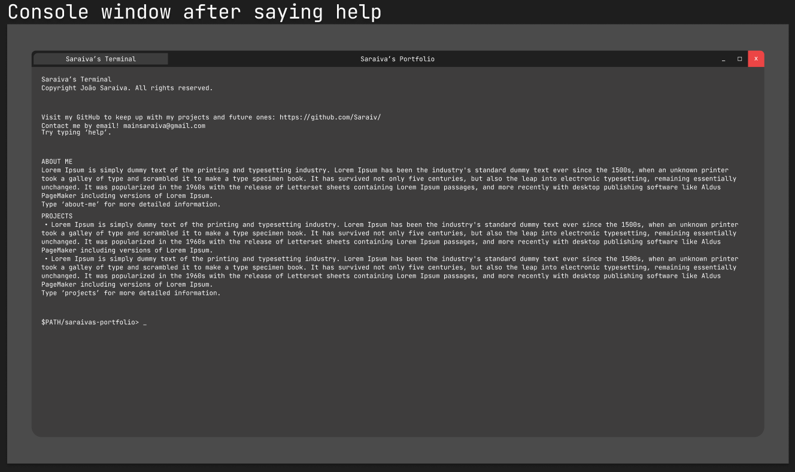

# Portfolio
My portfolio created from scratch by me


# Friendly reminder to me myself and i for firebase deployment
```npm run build```
```Set-ExecutionPolicy -Scope Process -ExecutionPolicy Bypass```
```firebase deploy --only hosting```

# Presentation
This was my first idea of what was my perfect portfolio idea.
So i made it all from scratch using figma and then implementing
it on a react application to improve my web app development
skills aswell as my software engeneering skills for my future.


As a programmer I tend i use console a lot so why not
making my own portfolio a console right?


There's plenty of commands you can try! Make yourself
confortable and there will be some easter eggs in the future
that tell you more about my life.

Hope you enjoy my work and as allways you can contact me by
email: mainsaraiva@gmail.com or through 
linkedIn: https://www.linkedin.com/in/jo%C3%A3o-saraiva-5103721b9/